# About the project
A company can experience rapid growth when it understands its customers' personality traits, enabling it to provide better services and benefits to potential loyal customers. By analyzing historical marketing campaign data to enhance performance and target the right customers for transactions on the company's platform, our main focus from these data insights is to create a predictive clustering model that facilitates the company in decision-making.

# Objective
- Generate customer segmentation based on features related to conversion rate.
- Provide business recommendation.

# Research Question
 - How much is customer segemted?
 - What affect customer segment?
 - Does customer segement help business to grow?

 # Hypotesis
 - Customer segement depends on feature use to divide the characteristic.
 - Features related to conversion rate.
 - Customer segment help marketing to have focused target, and then increase conversion rate.

 # Data
 Data were an ecommerce marketing historical data from 2020.

 # EDA
 In this part we explore data to know the distribution of each feature then find relation on specific target (conversion rate).

 ## Univariate Analysis
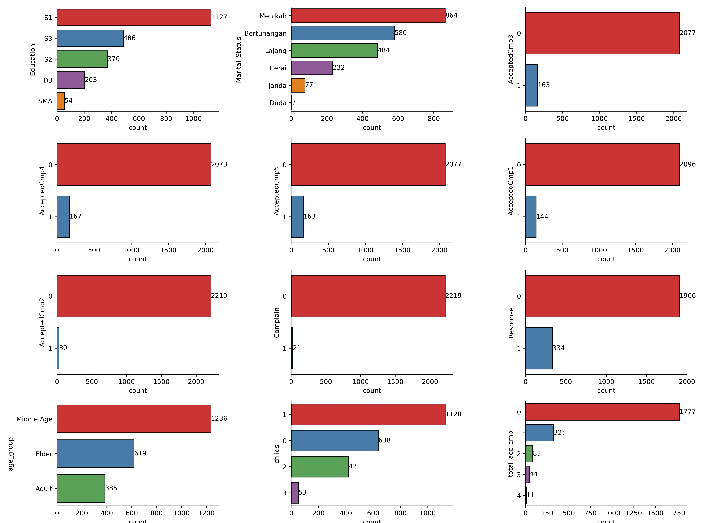
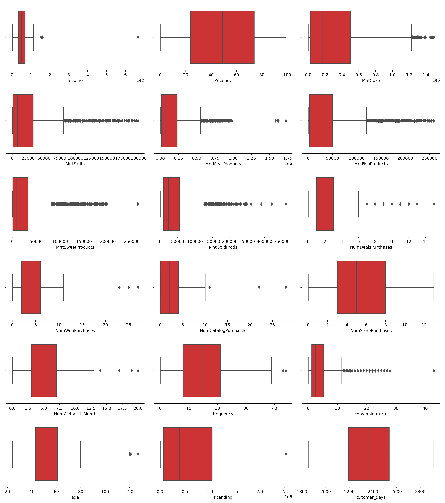

## Multivariate Analysis

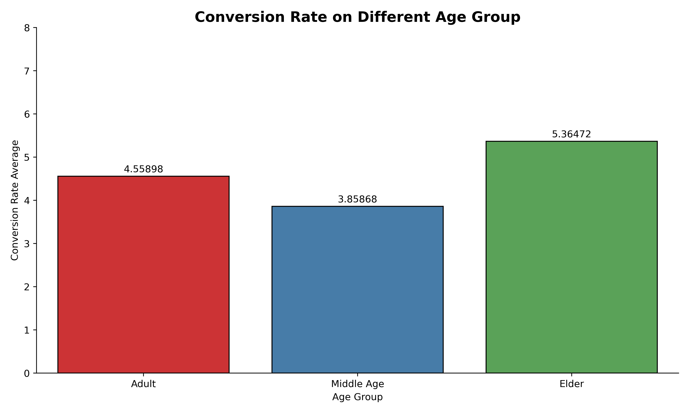

Elder age group have the highest average covertional rate it is 5.3, possibiity because elder does not explore to much on product and just bust right any campaign that suits they.

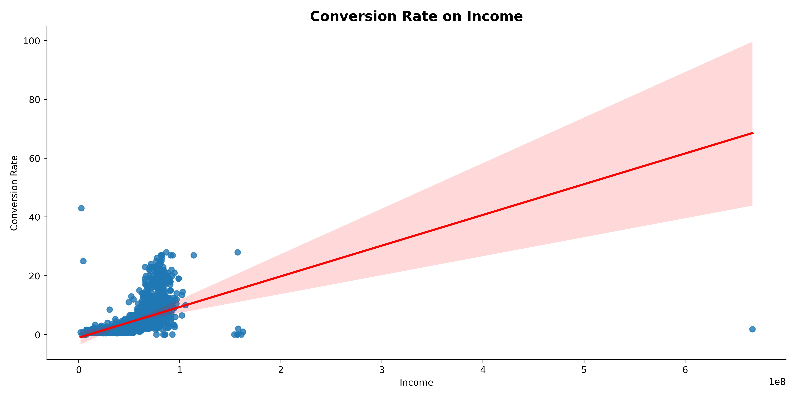

There is a positive correlation between income and conversion rate. The conversion rate is concentrated within the income range of 0 - 100,000,000, with a conversion rate value of 0-20.

There is a positive correlation between spending and conversion rate. The conversion rate tends to be concentrated around a spending of 1.5 million, with conversion rate values below 10.

# Data Preprocessing
There is some outliers in age and income feature, we handling this using zscore. On numerical features we do transformation using standard scaler to uniform data range. Last we encode education and age group feature with label encoding and maritas status with one hot encoder.

# Machine Learning Modeling
We use KMeans model to segment customers and to find optimal number of clusters we do elbow method and silhouette score.
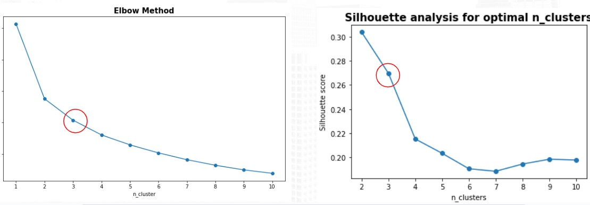

On image above we can subjectively decide thst 3 clusters is the optimal cluster.

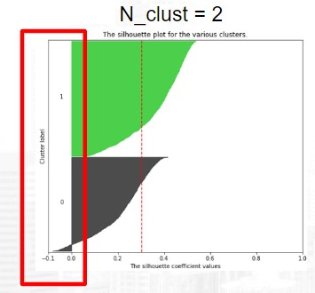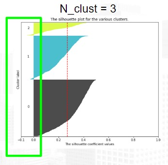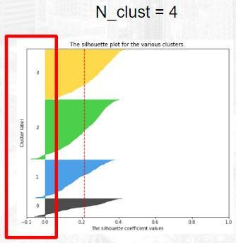

From silhoutte plot we can conclude that n cluster 3 is good choice rather than 2 or 4 cluster.

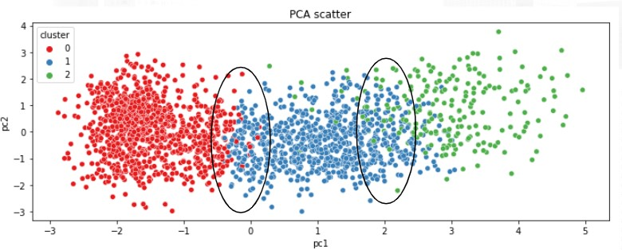

After modeling KMeans with 3 n cluster we got cluster label that can joined to dataset to visualize with PCA. From the plot we can ascertain segments were divided good enought with some transition at cluster border.

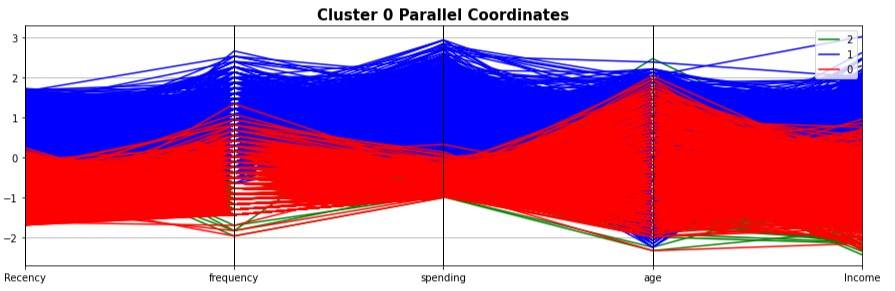
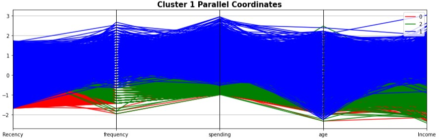
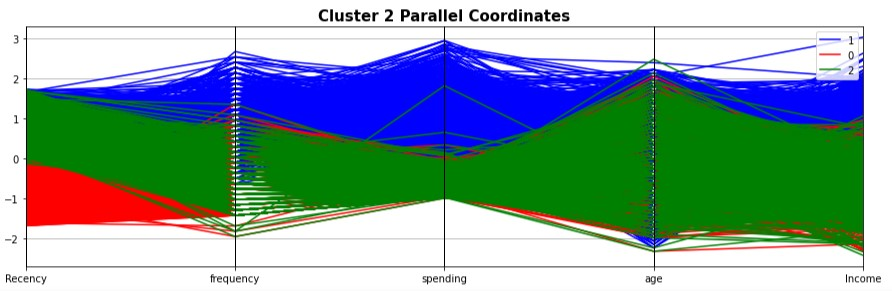

We can generate paralel coordinates plot to see how data distribution on each features to clusters.

# Summary
From this 3 cluster we can rename the cluster to ease decribing the segment.
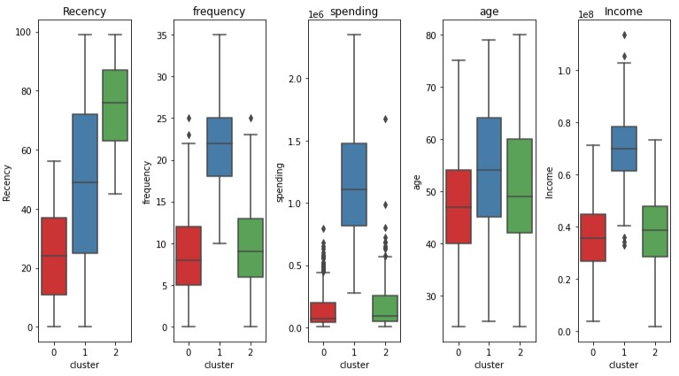

- Potential Loyalist (cluster 0)
    
    This segment accounts for 28.15% of the total customers. These customers exhibit low average recency (24.3 days), low average frequency (9 times), and low average spending (139,637). Customers in this cluster are aged between 40 - 54 years, with an average income of 35.8 million.

- Champions (cluster 1)

    Comprising 44.48% of the total customer base, these customers have a moderate average recency (48.5 days), high average frequency (21.6 times), and high average spending (1.1 million). Customers in this cluster are aged between 45 - 64 years, with an average income of 69.8 million.

- Needing Attention (cluster 2)

    This segment constitutes 27.37% of the total customer base. These customers exhibit a high average recency (75 days), low average frequency (9.7 times), and low average spending (163,971). Customers in this cluster are aged between 42 - 60 years, with an average income of 38.1 million.

# Recommendation
- Membership program aims to maintain customer recency by enticing them to keep purchasing products. With the membership, customers receive products at a discounted price, which encourages them to buy high-priced items in larger quantities.

- Seasonal discounts are designed to lower customer recency by offering discounts during specific seasons.

- Vouchers are targeted towards the "Need Attention" segment, aiming to capture customer interest and encourage purchases even if their recency is high and frequency is low.